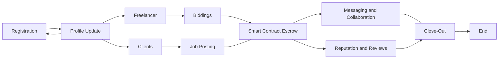

KaziNear-project
==================

Live Link: https://kazi-near-ljl7cv7zc-twigadevs.vercel.app/

This app was initialized with [create-near-app]

Description: The use case involves building a freelancing platform on the NEAR blockchain Network to enable cross-chain functionality and seamless integration. The platform aims to connect freelancers and clients, facilitating secure and transparent transactions while leveraging the benefits of blockchain technology.

## Key Features

1. User Registration and Profiles:
   - Freelancers and clients can create accounts and set up their profiles.
   - Users can provide details such as skills, experience, portfolio, and payment preferences.

2. Job Posting and Bidding:
   - Clients can post job requirements, including project details, scope, budget, and deadlines.
   - Freelancers can browse available jobs and submit bids based on their expertise and desired compensation.

3. Smart Contract Escrow:
   - When a client and freelancer agree on a project, a smart contract is created as an escrow for secure payment handling.
   - Funds are held in the escrow until the project milestones or deliverables are met and approved.

4. Messaging and Collaboration:
   - Integrated messaging system for clients and freelancers to communicate, share project details, and clarify requirements.
   - Collaboration tools for file sharing, version control, and project management.

5. Reputation and Reviews:
   - Users can provide ratings and reviews based on their experience with each other.
   - Reputation scores are calculated based on completed projects, feedback, and timely payments.

6. Multi-Chain Integration:
   - Utilize NEAR Wallets to enable seamless integration with various NEAR-compatible chains (e.g., Ethereum mainnet, testnets).
   - Users can choose their preferred chain for transactions, considering factors such as gas fees and transaction speed.

7. Wallet Integration:
   - Integration with NEAR Wallet to enable secure wallet management for users.
   - Users can connect their MetaMask wallets to the application for seamless transaction processing.

8. Payment and Escrow Release:
   - Clients can make payments to the escrow using cryptocurrency (e.g., Ether) or stablecoins (e.g., DAI).
   - Upon successful completion and approval of project milestones, funds are released from the escrow to the freelancer.

9. Dispute Resolution:
   - Mechanism for dispute resolution in case of conflicts between clients and freelancers.
   - Arbitration process utilizing smart contracts and third-party mediators if necessary.

10. Transaction History and Analytics:
   - Users can access a transparent transaction history, including payments made, received, and pending.
   - Analytics and reporting features to track project progress, earnings, and performance metrics.

## KaziKrypto Details 

Quick Start
===========

If you haven't installed dependencies during setup:

    npm install

Build and deploy your contract to TestNet with a temporary dev account:

    npm run deploy

Test your contract:

    npm test

If you have a frontend, run `npm start`. This will run a dev server.

Exploring The Code
==================

1. The smart-contract code lives in the `/contract` folder. See the README there for
   more info. In blockchain apps the smart contract is the "backend" of your app.
2. The frontend code lives in the `/frontend` folder. `/frontend/index.html` is a great
   place to start exploring. Note that it loads in `/frontend/index.js`,
   this is your entrypoint to learn how the frontend connects to the NEAR blockchain.
3. Test your contract: `npm test`, this will run the tests in `integration-tests` directory.

Deploy
======

Every smart contract in NEAR has its [own associated account][NEAR accounts]. 
When you run `npm run deploy`, your smart contract gets deployed to the live NEAR TestNet with a temporary dev account.
When you're ready to make it permanent, here's how:

Step 0: Install near-cli (optional)
-------------------------------------

[near-cli] is a command line interface (CLI) for interacting with the NEAR blockchain. It was installed to the local `node_modules` folder when you ran `npm install`, but for best ergonomics you may want to install it globally:

    npm install --global near-cli

Or, if you'd rather use the locally-installed version, you can prefix all `near` commands with `npx`

Ensure that it's installed with `near --version` (or `npx near --version`)

Step 1: Create an account for the contract
------------------------------------------

Each account on NEAR can have at most one contract deployed to it. If you've already created an account such as `your-name.testnet`, you can deploy your contract to `near-blank-project.your-name.testnet`. Assuming you've already created an account on [NEAR Wallet], here's how to create `near-blank-project.your-name.testnet`:

1. Authorize NEAR CLI, following the commands it gives you:

      near login

2. Create a subaccount (replace `YOUR-NAME` below with your actual account name):

      near create-account near-blank-project.YOUR-NAME.testnet --masterAccount YOUR-NAME.testnet

Step 2: deploy the contract
---------------------------

Use the CLI to deploy the contract to TestNet with your account ID.
Replace `PATH_TO_WASM_FILE` with the `wasm` that was generated in `contract` build directory.

    near deploy --accountId near-blank-project.YOUR-NAME.testnet --wasmFile PATH_TO_WASM_FILE

Step 3: set contract name in your frontend code
-----------------------------------------------

Modify the line in `src/config.js` that sets the account name of the contract. Set it to the account id you used above.

    const CONTRACT_NAME = process.env.CONTRACT_NAME || 'near-blank-project.YOUR-NAME.testnet'

Troubleshooting
===============

On Windows, if you're seeing an error containing `EPERM` it may be related to spaces in your path. Please see [this issue](https://github.com/zkat/npx/issues/209) for more details.

  [create-near-app]: https://github.com/near/create-near-app
  [Node.js]: https://nodejs.org/en/download/package-manager/
  [jest]: https://jestjs.io/
  [NEAR accounts]: https://docs.near.org/concepts/basics/account
  [NEAR Wallet]: https://wallet.testnet.near.org/
  [near-cli]: https://github.com/near/near-cli
  [gh-pages]: https://github.com/tschaub/gh-pages
